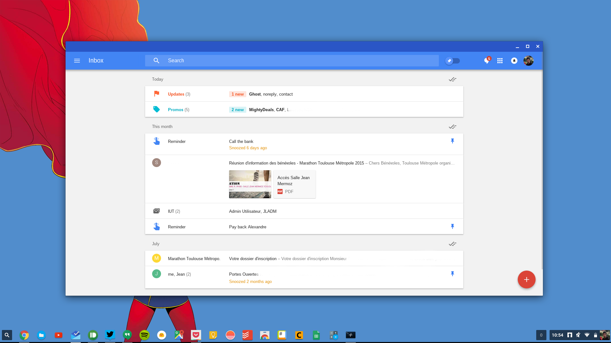

# Colored header Chrome Webview

## This repository is deprecated, I didn't update it in years and there's too much issues to solve, since I don't use Chrome OS as often as before, it won't be fixed.

Since a few Chrome versions, you can have colored frames / headers on Chrome Apps, like on Chrome OS' files.app!

However, it's not (yet?) possible to do this with hosted apps, that's why I created this small bit of code.

To open a website in a new Window with a colored header, you must do this : 

- Download or clone this repository
- Change the URL in webview.html
- Change the color and size in main.js
- Add a custom icon named 128.png in the extension's folder (must be 128*128 pixels)
- Change the app's name in manifest.json
- Go to chrome://extensions/
- Tick "Developer mode"
- Click "Load unpacked extension"
- Choose the right folder
- ENJOY !

-----------------------------

Depuis quelques versions de Chrome, on peut avoir des bordures de fenêtres colorés sur les applications Chrome, comme dans sur le navigateur de fichier de Chrome OS !

Cependant, ceci est impossible avec les "hosted apps", c'est là où mon code intervient.

Pour ouvrir un site dans une nouvelle fenêtre avec bordures colorées, faites ceci :

- Télechargez ou clonez ce dépôt
- Changez l'URL dans webview.html
- Changez la couleur et la taille dans main.js
- Ajoutez une icône personnalisée nommée 128.png dans le dossier de l'extension (elle doit faire 128*128 pixels)
- Changez le nom de l'application dans manifest.json
- Allez sur chrome://extensions/
- Cochez "Mode développeur"
- Clickez sur "Chargez l'extension non empaquetée"
- Choisissez le bon dossier
- ENJOY !

